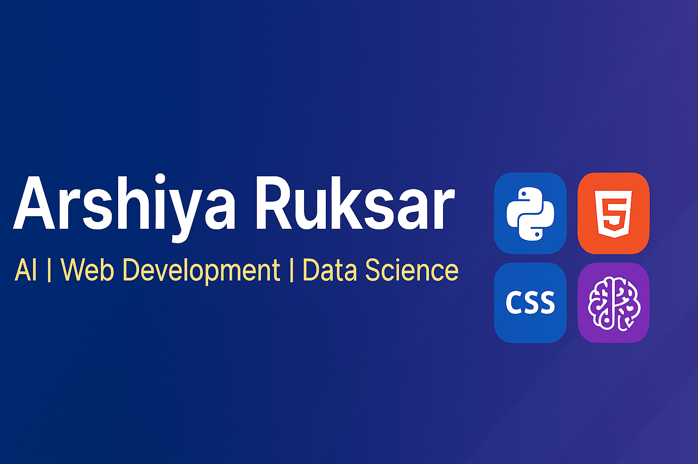

<!-- Intro Section -->

  
# 👋 Hey there, I'm **Arshiya Ruksar**
🎓 *BTech CSE Student at Sridevi Women’s Engineering College*  
💡 *Passionate about AI, Web Development, Data Science & Human–Computer Interaction*  
📍 *Hyderabad, India*  

 <!-- Replace with your banner -->

---

## 🚀 Skills & Tools

| **Languages** | **Tools** | **Domains** |
|---------------|-----------|-------------|
| Python | Power BI | Machine Learning |
| HTML | Excel | Data Analytics |
| CSS | OpenCV | Dashboard Development |
| SQL | MediaPipe, PyAutoGUI | HealthTech Solutions |

---

## 🏆 Certifications & Achievements

| **Certification / Workshop** | **Organization** |
|--------------------------------|------------------|
| Introduction to Data Science | Infosys |
| Machine learning  Workshop | - | Nextera unitech |
| Data Science Workshop | IIT Hyderabad |
| Power BI Workshop | - | IIT Hyderabad |
| Hackathon – Medical Passport | - |sridevi womens engineering college |

---

## 📫 Connect With Me

  
   

---

✨ *“Turning ideas into reality through code and creativity.”* ✨

